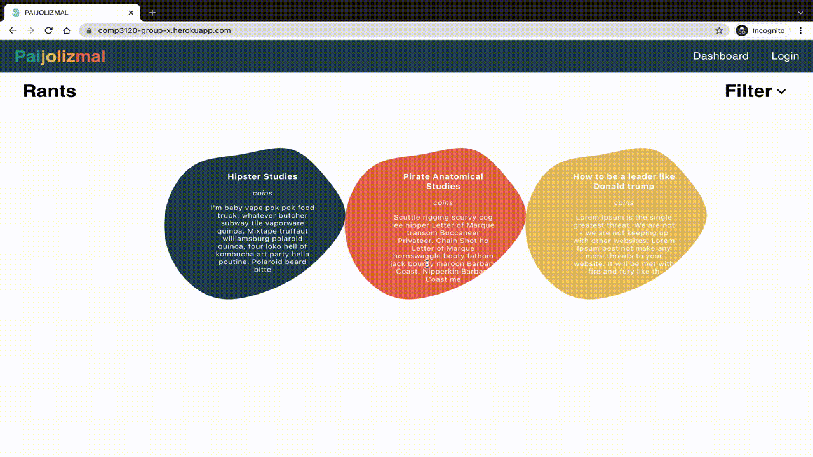

# [Paijolizmal](https://comp3120-group-x.herokuapp.com/) &middot; 

``Paijolizmal`` is a progressive web application which is for tracking productivity collaboratively built with React, MongoDB, Express, SASS and hosted with Heroku.

 
    
   
      <a href="https://www.mongodb.com/" target="_blank"> 
 
  
  

# Paijolizmal Outline

## Inspiration

Prolonged focused work is hard to achieve with the ever present distractions of today's technologie. As such it is more important than ever for students, researchers, and learners of all fields and disciplines to manage their focus.

``Paijolizmal`` is a focus tracking and aid application. The application was conceptualised as a community based app which would incentivise members to participate in focused work sessions and provide valuable feedback and tracking metrics on their work habits.

## Application Breakdown

* **Time Tracking:**
The main tracking services which ``Paijolizmal`` provides are in the form of *Pomodoro* style timed sessions. The *Pomodoro* method is a method for maintaining a sustained workflow over prolonged periods of time. In the traditional *Pomodoro* method, individuals usually set a focused work time of 30 to 50 minutes followed by a break time of 5 to 10 minutes, which are repeated for multiple hours. Participating in bursts of intense focused work for less than 1 hour, followed by reasonable breaks, has been shown to greatly improve effectiveness and efficiency, as well as provide a more sustainable method of work. Paijolismal provides users the ability to start timed sessions of up to 1 hour, ensuring that members take the necessary breaks to sustain their work and maintain their health. The timer implemented is intended to be easy to use and provide the minimal amount of friction to users starting their work.

* **Insentive to Work:** 
``Paijolizmal`` provides incentives for completing these timed sessions in the form of coins. The coins are paid out at the end of each completed session, and the amount paid out is based on the duration of the session. These coins can be utilised within the application by members to purchase ``RANTS``. A RANT is a ‘note’ which a user may write on and share with the ``Paijolizmal`` community. Users may use these ‘notes’ to write whatever they wish, though as is implied by the name (``RANTS``) these notes are intended to allow users to vent their frustrations and grievances. As students themselves, the development team of ``Paijolizmal`` know how important it is to be able to relieve stress and anxieties though sharing shared issues. Though users may also use their ``RANTS`` to share worlds of encouragement, short poems, or even share their achievements. All ``RANTS`` are displayed on a communal board where any other users and visitors to the site may see them. The sole purpose of these notes is to provide a community of like minded individuals, who all have an interest in furthering their studies, education and skills through managing their work.

* **Statistics Tracking:**
The final aspect of ``Paijolizmal`` is the stats tracking system. Every session completed provides valuable statistics which may be useful to users. These statistics come in the form of; time of day a user completed most of their sessions, number of sessions a user has completed consecutively, days of the week sessions were completed, over number of hours spent maintaining focused work, etc. These metrics are highly valuable as they can help members understand how they work and what works best for them, as no two members will work the same.

The developers of ``Paijolizmal`` committed themselves for 4 weeks to produce the first MVP of this application. The developers are passionate students with first hand experience in the trial and tribulations of managing intense workloads. It is hoped that this application both proves proof of the skills and capabilities of the team as competent developers, whilst also being a functionally valuable and valuable product.

# MVP Implementation

## Reworked milestones

As was expected, the aforementioned milestones simply served as a guide to development and were ultimately revised as work began. The following paragraphs will detail the revised workflow and the reasoning behind the changes made:

1. The first week proceeded mostly as expected, though it was decided that development should be begun on the database in the first week. Thus additional work was added into the weeks 1 work and milestone requirements.

2. Week two was too heavily weighted in the original milestone outline and as such was revised to push some of the tasks into the third week. Thus week 3 consisted of the implementation of most of the logic specified though transactions were moved back and the implementation of authentication was also paused.

3. The third week thus changed quite dramatically from the original plan with most of the time being delegated to the implementation of the transaction system and the authentication/validation systems. The only testing completed was ultimately in the form of manual testing within this milestone.

4. The final week revolved around polishing the application and resolving any logic issues which were still present. The transaction system required tweaking due to issues uncovered during the previous week and a large proportion of team resources were dedicated to polishing the application styling. The application was successfully deployed and the desired MVP results were achieved.

## Paijolizmal MVP

Following is a detailed review of all notable components which were implemented in the MVP produced. First the technical aspects of the applicaiton are detailed, followed by a breakdown of each page and the functionality achieved:

### **Technical components**

* **Backend:** The MVP ``Paijolizmal`` application has a MongoDB database with NodeJs, express and mongoose middleware implemented. The database collection has three main documents, notes, timers and users, with one supplementary document notetypes.

    * **Users:** the users document specified a list of all members of the ``Paijolizmal`` application. Each user consisted of a user id, username, password, stats, and coins. Services were provided to allow the creation of users, secure retrieval of user information validated through logging in, and the updating of users.

    * **Timers:** the timers document provides stored data which references timed user work sessions. The purpose of this document is to store valid timer data which may be utilised to verify a user's worked sessions. Each entry consists of an associated user, a session start time and a duration. The entries in this document are automatically removed upon verification of a timed session's completion.

    * **Notes:** the notes document provides a list of all the ``RANTS`` produced by users. The entries are detailed with an id, title, body or text content, associated user, and visualisation data. Services are provided to allow for the creation and retrieval of notes.

    * **Notetypes:** notetypes is a document utilised to store note variations. This allows for new note variations to be added and dynamically allowed for the generation of notes. A notetype is defined by an id, background colour and cost.

* **Frontend:** The ``Paijolizmal`` is a React application. The app implements Material UI (MUI) and Sass for the styling of the user interfaces. This allows for the applications to implement reactive design. All pages of the application are implemented to allow compatibility with a range of divides. The app can be comfortably accessed on mobile devices, larger tablets and desktop/laptop setups with wide screen monitors.

* **Security:**
``Paijolizmal`` handles very little sensitive data and this is by design. The application is not meant to be intrusive or provide high barriers to entry, the application is simply meant to be an easily accessible community that encourages interaction through sharing somewhat anonymously. Despite this though the application still implements reasonable security measures.

    * **Token authentication** is implemented into user sessions. Any user specific data or full application access requires a valid authentication token. Authentication tokens are passed to the server in request headers and stored locally on the client end in local storage.

    * **Password hashing** is implemented using the bcrypt library. A password is hashed the moment it is created and is never passed over a network unencrypted. Newly created passwords are hashed before being sent and stored in the database. Any future password comparisons are performed on the server side of the application, as a hashed password may be passed and then compared without ever having to decrypt the hashed passwords. Passwords are also not passed to the frontend client from the database.

    * **Validation:** Some minor security measures were also implemented to ensure that the timed sessions were validated. As the timer is a client side implementation, users may bypass the timed session to earn coins through altering their local computers state. In order to make the application more secure against such tactics, server side verification of timed sessions is implemented. When a timed session is started a timer entry is sent to the database using UTC time to define the start time and duration which may be verified by the server. This time is stored and once the session is completed another request is sent to the server which validates that the correct amount of time has passed. This secures the coin transaction process by ensuring that recipients actually deserve the coins they are receiving.

* **Deployment:**
``Paijolizmal`` is deployed and hosted on Heroku at [Paijolizmal](https://comp3120-group-x.herokuapp.com/) (note that this link will not be indefinitely supported).

### **Pages Breakdown**

The MVP of Paijolozmal required a reasonable list of client side components to make the application usable. The following section will break the application doen by pages and detail each of the components implemented as a part of this MVP.

* **Navigation Page:** A top navigation bar was included in the MVP to allow users to navigate between the home page, dashboard and login/out pages. If a user is logged in then the navigation bar will also provide the option for a user to logout. The navigation bar is styled with the custom colour pallet and features the application title logo.

* **Login and Logout Page:** The login page provides a form which is equipped with error handling to create a more seamless user experience. The page also directs the user to their dashboard upon successfully logging in. The sign up page allows for a user to create a new account and again is equipped to handle errors and display the appropriate messages to direct users.

* **Home Page:** The home page is equipped with a grid display of ``RANTS`` which have been posted. The home page may be seen by all users, logged in or not. The page provides interesting visuals through the animation of each RANT which was implemented through the user of Sass.

* **Dashboard Page:** The dashboard consists of three main components, the ``profile``, ``timer`` and ``shop``. Each of these components are organised to allow users on all devices to access their functionality. The styling is also kept consistent throughout by the overarching colour pallet of the application

    * The ``profile`` section of the dashboard allows users to view their personal information and statistics. The profile also allows users to edit and update their user information, including their username and password. The update form is styled using MUI compients and transitions to create a more pleasant user experience with a more reactive application.

    * The ``timer`` is implemented as a selection and display area. Times from 1 minute to 60 minutes may be selected to complete a timed session. A visitation of the time remaining in a session is provided through large circular progress bars which are animated. The timer automatically congratulates and updates the users balance once the session has completed and been validated.

    * Finally the ``shop`` section of the dashboard allows users to interact with a dynamic shop display. Users can scroll through custom selections of styled ``RANTS`` which they may then fill out with a title and body of text. The shop is animated and reactive creating an immersive experience in the application. The shop facilitates user transactions and if a purchase is successful will create users RANT and display it on the homepage for all users to view.

This MVP was completed on 7/1//2021. You can improve it by sending pull requests to [this repository](https://github.com/reactjs/reactjs.org).

# Where the most work has been done
📦group-web-project-group-x  
 ┣ 📂SCREENSHOTS  
 ┣ 📂public  
 ┣ 📂server  
 ┃ ┣ 📂controllers  
 ┃ ┣ 📂models  
 ┃ ┣ 📂testRequests  
 ┃ ┣ 📂tests  
 ┣ 📂src  
 ┃ ┣ 📂assets  
 ┃ ┃ ┣ 📂global  
 ┃ ┃ ┣ 📂img  
 ┃ ┃ ┣ 📂scss  
 ┃ ┃ ┃ ┣ 📂components  
 ┃ ┃ ┃ ┣ 📂layout  
 ┃ ┃ ┃ ┗ 📂views  
 ┃ ┣ 📂components  
 ┃ ┃ ┣ 📂header  
 ┃ ┃ ┣ 📂shop  
 ┃ ┣ 📂services  
 ┃ ┣ 📂tests  
 ┃ ┣ 📂views  
 ┃ ┃ ┣ 📂Dashboard  
 ┣ 📜DEPLOYMENT.md  
 ┣ 📜Procfile  
 ┣ 📜README.md  
 ┣ 📜jest.all.config.js  
 ┣ 📜package-lock.json  
 ┣ 📜package.json  
 ┗ 📜static.json  

`Paijolizmal` is a full-stack application composed of a frontend and backend section.

**Frontend**
        
The majority of the frontend source code will be found within the `src` directory.

`App.js`: serves as the core component and central controller of the application, rendering the routes used and collecting data from the server. `App.js` is generated by the application entry point `index.js`.

The `views` directory contains the main web pages and components of the application: 
* `HomePage.js`: Renders the home page with the list of notes.
* `LoginPage.js`: Contains the toggleable login and sign-up modules.
* `Navigation.js`: File which configures all the routes for the web page
* `PrivateRoute.js`: Used to render routes that require users to be authenticated before accessing.
* `Dashboard`: Directory containing all necessary elements for the Dashboard
    *` DashboardPage.js`: File responsible for the structure and rendering of all required components
    * `EarnedPopUp.js`: Component to calculate and display a pop-up message regarding earned coins after the Pomodoro session has been included.
    * `ErrorPopUp.js`: Component to be used to display any error message on the Dashboard
    * `PomodoroTimer.js`: The timer component that allows user to select an expected timeframe, then start, stop 
    * `ProfileCard.js`: Component to display user info, user statistics as well as the forms to allow the user to update their username or password

The `tests` directory contains all the frontend `jest` tests for the application. Inside this directory, we have:
* `jest.config.js`: Configures test environment and creates a mock server
* `Snapshots.test.js`: File containing various tests for frontend components

The `services` directory contains all the `axios` API calls required in the application. They separated into individual files: `TimerService.js`, `UserService.js`, and `NoteService`.js

The `assets` directory contains styling files used in all parts of the application:
* `Colours.js` contains all the colours used in the application, used to keep the theme of each page consistent
* `global` directory contains a file `_colours.scss` for all the available note blobs
* `img` directory contains the SVGs used in the `SlideShop` component
* `scss` contains an additional directory of all the `scss` files used to style pages in the applications

The `components` directory is for reusable or complex standalone components used in the application. 
* `Btn.js` styled button component used in the application for various buttons
* `Notes.js` and `NotesGrid.js` produce a styled view of all the notes currently used on the Homepage
* The `header` directory contains the files `Header.js` and `HeaderMenu.js` that renders the top navigation pane on the application
* The `shop` directory contains the `SlideShop.js` component and `NoteEditorjs`, which makes up the entire shop in the Dashboard

**Backend**
        
The backend code can be found in the `server` directory. The backend uses Node/Express and is connected to a MongoDB database. In that directory, we have: 
* `server.js`: initialises the server on the correct port
* `app.js`: contains the configuration of the Express server
* `ingestdb.js`: file used for a temporary replacement of database
* `models` directory: contains the Mongoose schema for each object to be stored in the database
* `controllers` directory: contains the routing for each request made for/to the objects in the database
* `testRequests` directory: contains a file for each request that allows for API requests to be made without the need of a frontend client
* `tests` directory: contains the various `jest` tests for the backend, including a configured test environment

# Next Steps
Given extra time to work on the application, there are a number of possible improvements.        
        
**Additional Note Designs**
        
More colours and shapes for the notes could be released for the shop, which could induce further excitement for the app.

**User Interaction** 
        
Include the capability of users to interact with each other using comments, likes, and public-facing profiles. Having this feature could increase user numbers as well as help to retain users on the platform.

**Visual Time Tracking Statistics**
        
Breakdown statistics by task category and provide a more detailed visual view in charts/graphs. By introducing this view on top of the numerical statistics, users with a preference for visual data can be inspired to continue being productive with their time.

**Enhanced Security** 
Use session tokens to manage the frontend login session instead of a `jwt` token. Handle the `jwt` tokens entirely on the server side. This would prevent malicious attackers from simulating legitimate user requests.

**Improved Scalability** Implement handling of many notes; this could either be listing notes by category or viewing notes by user groups or user associations. Currently, all existing notes are being displayed on the homepage, which could potentially get out of hand.

## Communication & Roles
### Communication
* [Trello](https://trello.com/b/Qfrxz3KY/group-project-comp3120) is a collaborative tool, useful for agile development. Trello tickets have the capability to assign members, add comments, establish checklists, attach deadlines, add labels (e.g. `blocked`, or `done`) and more. These features enabled group members to communicate their progress, constraints, as well as pass on directly relevant information. Group X used multiple lists throughout the project that contained tracked tasks to be completed. Notable lists were:
   * Product Backlog: included the tickets to be completed in the project overall (scrum, comments, labels)
   * Sprint Backlog: contained the tickets to be completed in the current sprint
   * Increment: included completed tasks from all the completed sprints
   * Action Items: miscellaneous and non-coding related tasks
   * Bugs: the record of unexpected behaviours to address

* [Discord](https://discord.com/) serves as the primary communication platform for team members. Discord allows for the creation of separate channels in a private server for members to use, thus making it easier to track information shared by others, such as essential links or announcements. It also has voice channels, which was used to host weekly 1 hour meetings throughout the project.

* [Google Drive](https://docs.google.com/document/d/13KKy5rsJJ_vo6XVw1Ib0G1EyBDpnYyWprtSj0C4mlhw/edit?usp=sharing) is a cloud platform which was used to share and store relevant files for the project accessible by members of the group.

* [GitHub](https://github.com/MQCOMP3120-2021/group-web-project-group-x) is a version control platform that was used throughout development. To avoid clashes during development, members would break off into separate branches (for each feature). Once the feature was completed, a pull request would be created and reviewed by other members before being merged into the `master` branch.

* [Figma](https://www.figma.com/file/F0mzjtvkoUU5UOSzJtzv1L/The-Second-Draft?node-id=0%3A1) is a visual tool used for various purposes. Initially it had been used to brainstorm ideas for the application, as multiple users can make changes simultaneously. Once the outline for the application had finished, wireframes for each page were constructed by the team to further solidify the design and flow for the application. The project's lead designer then built on the wireframes for a preliminary design and theme for the website. After the website had matured, the final theme and design were established and used as a reference for the developer to finalise the styling.

 ### Roles 
 * Front-End Software Engineer/Lead Designer: [Jonah Skinner](https://github.com/J5kinner)  
    **Main Responsibilities**
    * Produce designs for the application, including the structure of visual elements and colour themes
    * Polish existing styling already live on the website
    * Communicate and distribute design elements to team members

    **Additional Contributions**
    * Deployment on Heroku
    * Shop development
    * Testing

 * Middleware Software Engineer: [Elizabeth Laham](https://github.com/elizabetht94)  
    **Main Responsibilities**
    * Handle and streamline communication from the client-side to server-side

    **Additional Contributions**
    * User sign up/login and client-side authentication
    * Helped with deployment
    * Add styling to various components on client-side

 * Frontend Software Engineer: [Paige Anthony](https://github.com/paigelea)  
    **Main Responsibilities**
    * Implement functionality for various components for the client-side application
    * Add in design to elements to the application

    **Additional Contributions**
    * Documentation
    * Establish the application logic for the timer

 * Backend Software Engineer:  [Malachi Mashiah](https://github.com/Ner0theHer0)  
    **Main Responsibilities**
    * Set up database and server
    * Configure object models
    * Configure backend routing for object interaction/creation

    **Additional Contributions**
    * User authentication/token handling

