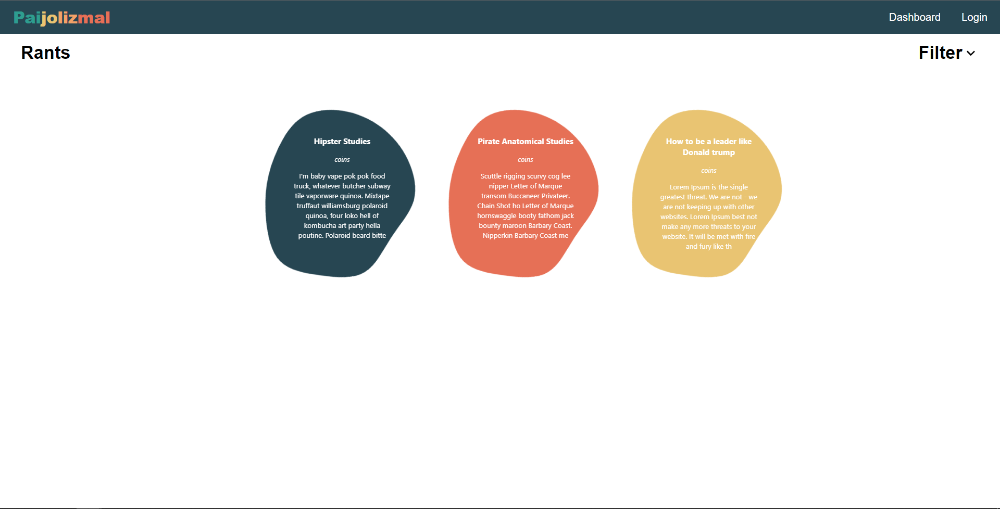
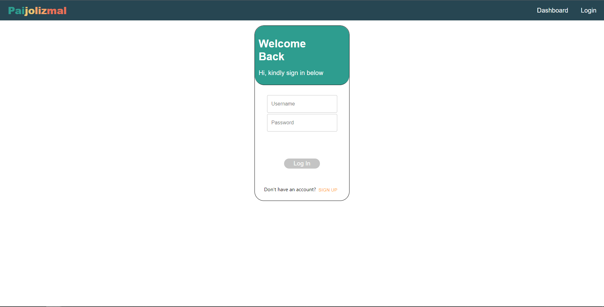
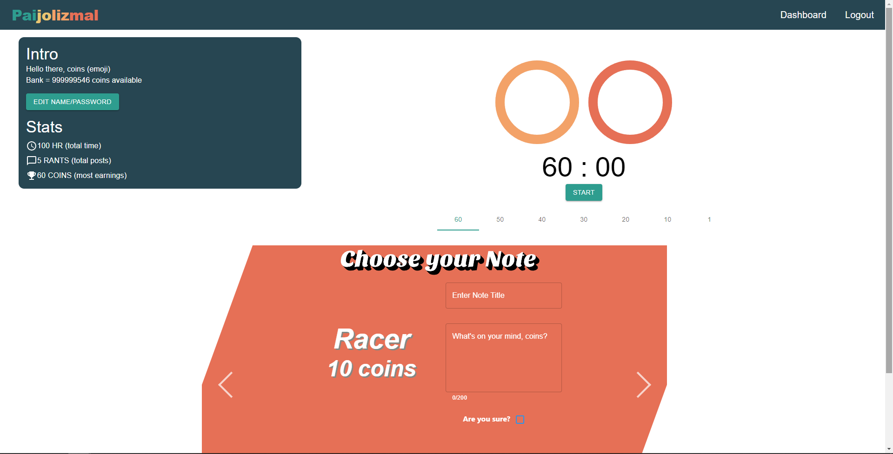
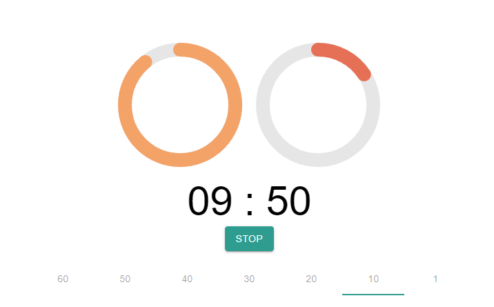
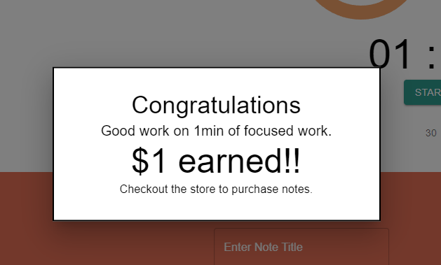
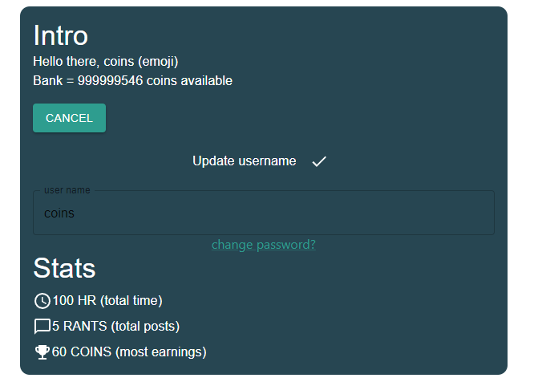
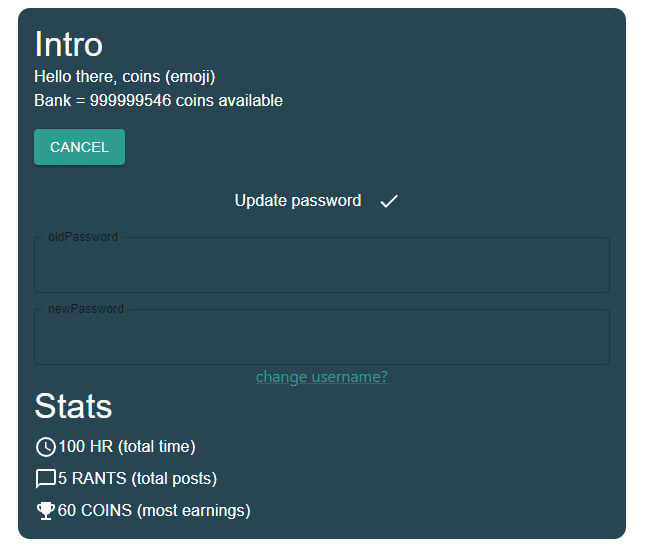

# Screenshots

The following screenshots provide a visual glimpse of the application.

## Homepage.png

This image shows the homepage of the application. This is the page displayed when the page is first loaded.

## Login.png

This window is shown if a user clicks on the "Login" button or tries to access the dashboard while not authenticated. If the user does not have an account, they can click the "Sign Up" button to create one.

## Create User.png

This page is shown if a user clicked the "Sign Up" button, where they can specify a username and password for account creation

## Dashboard.png

This page contains the main functionality of the application. It shows the user some of their usage stats, the interactive pomodor timer and the note creation tool.

## Timer Progress.png

A screenshot of an in-progress pomodoro timer.

## Finished Timer.png

Dialog displayed once the timer has been successfully finished.

## Username.png

Prompt shown when a user requests to change their username

## Password.png

Prompt shown when a user requests to reset their password

